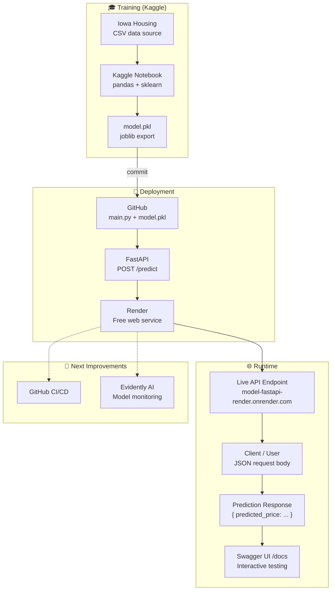

# 🏠 Iowa Housing Price Predictor

A beginner machine learning project based on Kaggle's **Intro to Machine Learning** course. The model is trained on the Iowa Housing dataset, served via **FastAPI**, and deployed as a live web service on **Render**.

🔗 **Live API:** [https://model-fastapi-render.onrender.com/docs](https://model-fastapi-render.onrender.com/docs)  
📓 **Kaggle Notebook:** [exercise-your-first-machine-learning-model](https://www.kaggle.com/code/haditeo/exercise-your-first-machine-learning-model/)

---

## 📖 About

This project demonstrates an end-to-end ML workflow — from training a simple regression model in Kaggle, to deploying it as a REST API accessible over the internet. It is intended as a portfolio starting point for ML model deployment using free-tier tools.

> 💡 Claude AI was used to help design and integrate the overall project structure, from model export to API deployment.

---

## 🏗️ Solution Architecture



---

## 🧠 Model

- **Type:** Decision Tree Regressor (scikit-learn)
- **Dataset:** Iowa Housing (Kaggle Intro to Machine Learning)
- **Target:** Predicted house sale price (USD)
- **Export format:** `.pkl` via `joblib`

### Input Features

| Field | Type | Description |
|---|---|---|
| `LotArea` | `int` | Lot size in square feet |
| `YearBuilt` | `int` | Year the house was built |
| `FirstFlrSF` | `int` | First floor area in square feet |
| `SecondFlrSF` | `int` | Second floor area in square feet |
| `FullBath` | `int` | Number of full bathrooms |
| `BedroomAbvGr` | `int` | Number of bedrooms above ground |
| `TotRmsAbvGrd` | `int` | Total rooms above ground |

---

## 🚀 Tech Stack

| Layer | Tool |
|---|---|
| Model Training | Python, scikit-learn, pandas (Kaggle) |
| Model Export | `joblib` → `.pkl` |
| API Framework | FastAPI |
| Deployment | Render (free tier, GitHub integration) |
| Source Control | GitHub |

---

## 🔧 Running Locally

```bash
# Clone the repository
git clone https://github.com/<your-username>/<your-repo>.git
cd <your-repo>

# Install dependencies
pip install -r requirements.txt

# Start the API server
uvicorn main:app --reload
```

Then open [http://localhost:8000/docs](http://localhost:8000/docs) to access the interactive Swagger UI.

---

## 📬 API Usage

**Endpoint:** `POST /predict`

**Request body (JSON):**
```json
{
  "LotArea": 8450,
  "YearBuilt": 2003,
  "FirstFlrSF": 856,
  "SecondFlrSF": 854,
  "FullBath": 2,
  "BedroomAbvGr": 3,
  "TotRmsAbvGrd": 8
}
```

**Response:**
```json
{
  "predicted_price": 208500.0
}
```

---

## 📁 Project Structure

```
├── main.py              # FastAPI app and prediction endpoint
├── model.pkl            # Trained scikit-learn model (exported via joblib)
├── requirements.txt     # Python dependencies
└── README.md
```

---

## 💡 Key Lessons Learned

- A **CSV file** is required as the data source to train the model
- The trained model is exported as a **`.pkl` file** using `joblib` for deployment
- **FastAPI** is used to expose the model as a REST API endpoint
- **Render** provides a free hosting service with direct **GitHub integration**, making deployment straightforward — any push to the main branch triggers a redeploy
- The entire pipeline (train → export → serve → deploy) can be assembled using free tools

---

## 🔭 Next Improvements

- [ ] **GitHub CI/CD** — automate testing and deployment on every push
- [ ] **Evidently AI integration** — monitor model performance and detect data drift over time

---

## 📚 Learning Reference

- [Kaggle — Intro to Machine Learning](https://www.kaggle.com/learn/intro-to-machine-learning)
- [FastAPI Documentation](https://fastapi.tiangolo.com/)
- [Render Deployment Guide](https://render.com/docs)
- [Evidently AI](https://www.evidentlyai.com/)

---

## 👤 Author

**Hadi** — Production Support Engineer transitioning into AI/MLOps  
[LinkedIn](https://linkedin.com/in/haditeo/) · [Kaggle](https://www.kaggle.com/haditeo)
