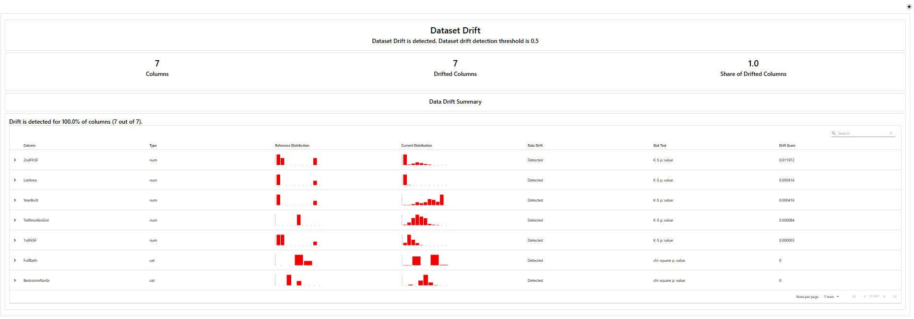

# 🏠 Iowa Housing Price Predictor

A beginner machine learning project based on Kaggle's **Intro to Machine Learning** course. The model is trained on the Iowa Housing dataset, served via **FastAPI**, and deployed as a live web service on **Render**.

🔗 **Live API:** https://model-fastapi-render.onrender.com/docs  
📊 **Drift Report:** https://model-fastapi-render.onrender.com/report  
📓 **Kaggle Notebook:** [exercise-your-first-machine-learning-model](https://www.kaggle.com/code/haditeo/exercise-your-first-machine-learning-model/)

---

## 📖 About

This project demonstrates an end-to-end ML workflow — from training a simple regression model in Kaggle, to deploying it as a REST API accessible over the internet. It is intended as a portfolio starting point for ML model deployment using free-tier tools.

> 💡 Claude AI was used to help design and integrate the overall project structure, from model export to API deployment.

---

## 🏗️ Solution Architecture

[](architecturev2.svg)

---

## 🧠 Model

* **Type:** Decision Tree Regressor (scikit-learn)
* **Dataset:** Iowa Housing (Kaggle Intro to Machine Learning)
* **Target:** Predicted house sale price (USD)
* **Export format:** `.pkl` via `joblib`

### Input Features

| Field | Type | Description |
| --- | --- | --- |
| `LotArea` | `int` | Lot size in square feet |
| `YearBuilt` | `int` | Year the house was built |
| `FirstFlrSF` | `int` | First floor area in square feet |
| `SecondFlrSF` | `int` | Second floor area in square feet |
| `FullBath` | `int` | Number of full bathrooms |
| `BedroomAbvGr` | `int` | Number of bedrooms above ground |
| `TotRmsAbvGrd` | `int` | Total rooms above ground |

---

## 🚀 Tech Stack

| Layer | Tool |
| --- | --- |
| Model Training | Python, scikit-learn, pandas (Kaggle) |
| Model Export | `joblib` → `.pkl` |
| API Framework | FastAPI |
| Containerisation | Docker |
| Deployment | Render (free tier, GitHub integration) |
| Source Control | GitHub |
| Model Monitoring | Evidently AI |

---

## 📊 Model Monitoring — Evidently AI

This project integrates **[Evidently AI](https://www.evidentlyai.com/)** to monitor model health and detect data drift over time.

### Drift Report

A pre-generated **Data Drift Report** is served directly from the API and can be accessed at:

🔗 https://model-fastapi-render.onrender.com/report



The report compares the **reference dataset** (training data) against a **current dataset** (recent predictions or test data) to identify:

* **Feature drift** — whether the distribution of input features has shifted
* **Dataset-level drift** — an overall drift score across all features
* Individual feature statistics (mean, std, distribution plots)

### Why Drift Monitoring Matters

In production, real-world data can drift away from the training distribution over time — house prices, market conditions, and buyer behaviour all change. Without monitoring, a model can silently degrade in accuracy. Evidently AI makes this observable.

---

## 🔧 Running Locally

```bash
# Clone the repository
git clone https://github.com/<your-username>/<your-repo>.git
cd <your-repo>

# Install dependencies
pip install -r requirements.txt

# Start the API server
uvicorn main:app --reload
```

Then open http://localhost:8000/docs to access the interactive Swagger UI.  
And http://localhost:8000/report to view the Drift Report.

**Or run with Docker:**

```bash
docker build -t housing-predictor .
docker run -p 8000:8000 housing-predictor
```

---

## 📬 API Usage

**Endpoint:** `POST /predict`

**Request body (JSON):**

```json
{
  "LotArea": 8450,
  "YearBuilt": 2003,
  "FirstFlrSF": 856,
  "SecondFlrSF": 854,
  "FullBath": 2,
  "BedroomAbvGr": 3,
  "TotRmsAbvGrd": 8
}
```

**Response:**

```json
{
  "predicted_price": 208500.0
}
```

---

## 📁 Project Structure

```
├── main.py              # FastAPI app, prediction endpoint, and drift report route
├── model.pkl            # Trained scikit-learn model (exported via joblib)
├── Dockerfile           # Container definition for the API
├── requirements.txt     # Python dependencies
└── README.md
```

---

## 💡 Key Lessons Learned

* A **CSV file** is required as the data source to train the model
* The trained model is exported as a **`.pkl` file** using `joblib` for deployment
* **FastAPI** is used to expose the model as a REST API endpoint
* **Docker** packages the FastAPI app and model into a portable container, ensuring consistent behaviour across environments
* **Render** provides a free hosting service with direct **GitHub integration**, making deployment straightforward — any push to the main branch triggers a redeploy
* **Evidently AI** generates HTML drift reports that can be served directly as a FastAPI route, enabling lightweight model observability without a separate dashboard
* The entire pipeline (train → export → containerise → serve → deploy → monitor) can be assembled using free tools

---

## 🔧 Troubleshooting & Lessons from the Trenches

### 1. `pickle` vs `joblib` for model export

Initially used Python's built-in `pickle` to save the model, which worked locally but caused errors on Render during loading. The fix was to switch to `joblib`, which is the recommended way to serialise scikit-learn models.

```python
# ❌ What I tried first — caused issues on Render
import pickle
with open("model.pkl", "wb") as f:
    pickle.dump(model, f)

# ✅ Correct approach
import joblib
joblib.dump(model, "model.pkl")

# Loading
model = joblib.load("model.pkl")
```

---

### 2. `requirements.txt` is critical for Render

Render uses `requirements.txt` to install dependencies when building the container. Missing or unpinned versions caused version mismatch errors between the environment where the model was trained and where it was served.

Pinning exact versions resolved the issue:

```
scikit-learn==1.2.2
numpy==1.26.4
```

> ⚠️ The model must be trained and exported using the **same version** of scikit-learn that is installed at runtime. A version mismatch will cause the model to fail to load.

**Error encountered — scikit-learn version mismatch:**

Without pinning `scikit-learn`, Render installed a different version than what was used to train the model, causing this cryptic error on startup:

```
File "sklearn/utils/murmurhash.pyx", line 1, in init sklearn.utils.murmurhash
ValueError: numpy.dtype size changed, may indicate binary incompatibility.
Expected 96 from C header, got 88 from PyObject
```

This error looks like a numpy problem but the **root cause is a scikit-learn and numpy version mismatch**. The compiled C extensions inside scikit-learn were built against a specific numpy ABI (binary interface), and when the numpy version differs, the internal data structure sizes no longer align.

**Fix:** pin both packages together to versions that are known to be compatible:

```
scikit-learn==1.2.2
numpy==1.26.4
```

**Error encountered — numpy version mismatch:**

A similar binary incompatibility error also appeared independently when numpy alone was on the wrong version. numpy's internal dtype struct size changed between versions, so even a minor version difference can break scikit-learn's compiled extensions at import time.

The lesson: **always pin both `scikit-learn` and `numpy` together**. They are tightly coupled at the C extension level and must be treated as a matched pair.

---

### 3. Matching the FastAPI schema and predict function to the model

Three things in `main.py` must exactly match the model's training features — field names, field order, and the response key. Getting any one of these wrong will cause silent errors or wrong predictions.

**The input schema (`InputData`)** defines what JSON fields the API accepts. Field names must be valid Python identifiers, which required renaming two columns from the original dataset:

```python
class InputData(BaseModel):
    LotArea: int
    YearBuilt: int
    FirstFlrSF: int   # renamed — Python doesn't allow '1st' as variable name
    SecondFlrSF: int  # renamed — same reason
    FullBath: int
    BedroomAbvGr: int
    TotRmsAbvGrd: int
```

**The predict function** must pass features to the model as a numpy array in the **exact same column order** used during training. A wrong order will produce incorrect predictions with no error thrown:

```python
def predict(data: InputData):
    features = np.array([[
        data.LotArea,
        data.YearBuilt,
        data.FirstFlrSF,   # mapped back to correct order
        data.SecondFlrSF,
        data.FullBath,
        data.BedroomAbvGr,
        data.TotRmsAbvGrd
    ]])
```

**The return value** must be a dictionary with a meaningful key. Rounding the float also prevents overly precise outputs:

```python
return {"predicted_price": round(float(prediction[0]), 2)}
```

> ⚠️ The column order in the `np.array` must match the order of features used when `model.fit()` was called in the Kaggle notebook — not the order of fields in `InputData`.

---

### 4. Using Render Events to debug deployments

Render's **Events** tab (in the service dashboard) is invaluable for understanding what is happening during a deployment. It shows each step Render takes when pulling code from GitHub — including dependency installation, build logs, and startup errors.

This was the first hands-on experience seeing what happens "behind the scenes" when Render picks up a GitHub push:

1. Render detects a new commit on the connected branch
2. It pulls the latest code
3. Runs `pip install -r requirements.txt`
4. Starts the web service with the defined start command
5. Reports success or failure with logs

Checking the Events log was the fastest way to identify why a deployment was failing.

---

## 🔭 Next Improvements

* **GitHub CI/CD** — automate testing and deployment on every push
* **Scheduled drift re-generation** — automate the Evidently report to refresh against live prediction logs on a schedule

---

## 📚 Learning Reference

* [Kaggle — Intro to Machine Learning](https://www.kaggle.com/learn/intro-to-machine-learning)
* [FastAPI Documentation](https://fastapi.tiangolo.com/)
* [Docker Documentation](https://docs.docker.com/)
* [Render Deployment Guide](https://render.com/docs)
* [Evidently AI](https://www.evidentlyai.com/)

---

## 👤 Author

**Hadi** — Production Support Engineer transitioning into AI/MLOps  
[LinkedIn](https://linkedin.com/in/haditeo/) · [Kaggle](https://www.kaggle.com/haditeo)
